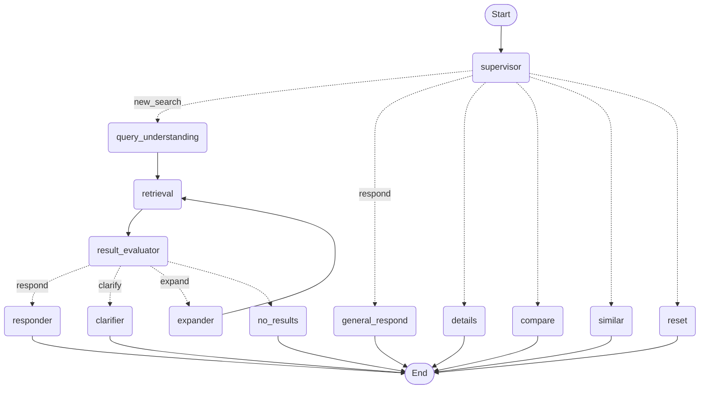

# Shopify Ecommerce Assistant Bot

A production ready conversational product search system that combines hybrid retrieval (vector + keyword search), LLM - powered query understanding, and multi-turn conversation management.


## Features

- Natural language shopping conversations
- Product search and retrieval
- Query understanding and entity extraction
- Similar product search
- Intent classification
- Maintains context across exchanges with stateful agents
- Gradually loosens constraints automatically when no results found 
- Frontend friendly structured JSON responses
- Side-by-side product comparison with highlight detection
- Expand/clarify question handling automaatically 
- Reviews influence ranking and enrich product details
- Modular architecture for future tools

## Tech Stack

| Component | Technology |
|------------|-------------|
| Backend | Python 3.13+, FastAPI, LangGraph |
| Database | Supabase (PostgreSQL + pgvector) |
| Embeddings | SentenceTransformers (`all-MiniLM-L6-v2`) |
| LLM | Groq (Llama 3.3 70B / Llama 3.1 8B) |
| Auth | JWT (HS256/ JOSE) |
| Search | Hybrid Search (Vector + PostgreSQL FTS + RRF Fusion) |

## Project Structure

```text
shopify-ecommerce/
│
├── app/
│   │
│   ├── agents/                          # LangGraph conversation agents
│   │   ├── graph.py                     # State graph definition
│   │   ├── runner.py                    # Session management & persistence
│   │   ├── state.py                     # Typed conversation state
│   │   │
│   │   └── nodes/
│   │       ├── supervisor.py            # Intent classification/routing
│   │       ├── query_understanding.py   # LLM query parsing
│   │       ├── retrieval.py             # Hybrid search execution
│   │       ├── result_evaluator.py      # Result quality evaluation
│   │       ├── expander.py              # Constraint relaxation
│   │       ├── clarifier.py             # Clarifying questions
│   │       ├── responder.py             # Response generation
│   │       ├── details_similar.py       # Product details/similar products
│   │       ├── compare.py               # Product comparison
│   │       └── reset.py                 # Session reset
│   │
│   ├── retrieval/                       # Search engine
│   │   ├── hybrid.py                    # HybridRetriever singleton
│   │   ├── vector_search.py             # pgvector similarity search
│   │   ├── keyword_search.py            # PostgreSQL full-text search
│   │   ├── rrf_fusion.py                # Reciprocal Rank Fusion
│   │   ├── filters.py                   # Post-retrieval filtering
│   │   ├── price_enrichment.py          # Price enrichment
│   │   ├── reviews.py                   # Review ranking
│   │   └── product_details.py           # Full product data
│   │
│   ├── understanding/                   # Query understanding pipeline
│   │   ├── normalizer.py                # Input cleaning
│   │   ├── parser.py                    # LLM extraction
│   │   ├── validator.py                 # Validation and brand mapping
│   │   ├── models.py                    # ParsedQuery schema
│   │   └── brand_map.py                 # Fuzzy brand matching
│   │
│   ├── embeddings/
│   │   ├── generator.py                 # SentenceTransformer embedding generator
│   │   └── models.py                    # Embedding payloads
│   │
│   ├── data/
│   │   ├── loaders/
│   │   │   ├── product_loader.py        # CSV -> products
│   │   │   └── review_loader.py         # CSV -> reviews
│   │   │
│   │   └── seed.py                      # Data ingestion pipeline
│   │
│   ├── db/
│   │   ├── supabase_client.py           # Singleton Supabase client
│   │   │
│   │   └── repositories/
│   │       ├── product_repository.py   # Products + variants + product embedding -> Supabase tables
│   │       └── review_repository.py    # Review + review embedding -> Supabase tables
│   │
│   ├── api/
│   │   ├── routes.py                    # FastAPI endpoints
│   │   ├── models.py                    # Request/response schemas
│   │   └── auth.py                      # JWT authentication
│   │
│   ├── shopify/
│   │   └── fetch_for_seed.py            # Shopify product link sync for direct links to products
│   │
│   ├── cache/
│   │   └── brand_catalog.py             # Runtime brand cache
│   │
│   ├── config.py                        # Application settings
│   ├── logging.py                       # Logging 
│   ├── main.py                          # FastAPI application
|   └── seed.py                          # Complete data ingetion pipeline to supabase
│
├── frontend/                            # Frontend application (basic html, css, js)
├── chat_sessions/                       # Session persistence (No separate DB for now)
├── supabase/                            # Supaabase cli
│
├── Dockerfile
├── requirements.txt
├── .env.example
└── README.md
```

## Agent Workflow




## Database Schema (Supabase)

- Core Tables

1. products - Product metadata + embedding vector 
2. product_variants - SKU, price, options per product
3. reviews - User reviews + rating
4. product_embeddings - Vector store for product search
5. review_embeddings - Vector store for semantic review search

- Key Functions

1. match_products() - Vector similarity search with threshold
2. keyword_search_products() - PostgreSQL FTS with ranking
3. get_similar_products() - Product similarity via embeddings

## Setup

### 1. Initial (Python 3.10+)

```
# Clone and run
git clone https://github.com/krishnaverma001/shopify-agent.git

cd shopify-agent
mv .env.example .env

# Edit .env with your keys

# Install requirements
pip install -r requirements.txt
```

### 2. Environment Variables from .env.example

```
SUPABASE_URL=your_supabase_url
SUPABASE_PUBLIC_KEY=your_supabase_anon_key
SUPABASE_SERVICE_ROLE_KEY=your_service_role_key
GROQ_API_KEY=your_groq_api_key
SHOPIFY_STORE_DOMAIN=yourstore.myshopify.com
SHOPIFY_ACCESS_TOKEN=your_admin_api_token
SHOPIFY_API_VERSION=2026-04
EMBEDDING_MODEL=all-MiniLM-L6-v2
BATCH_SIZE=32
APP_NAME=AI Shopping Agent
SECRET_KEY=dev
```

### 3. Database Setup

```
# Install Supabase CLI
brew install supabase/tap/supabase

# Link to your Supabase project
supabase link --project-ref your-project-ref

# Paste the existing migration file under supabase/migrations/...

# Run migrations
supabase db push     # use below seed commaand instead
```

### 4. Seed Data
```
python -m app.seed
# or simply use 
# just seed
```

This will:

- Load products and reviews from CSV
- Sync with Shopify (fetch real product/variant IDs)
- Generate embeddings for all products
- Load reviews and generate review embeddings
- Preload brand catalog into cache

## Run API

```
uvicorn app.main:app --host 127.0.0.1 --port 8000 --reload
# or simply use 
# just run
```

- Authentication endpoint

```
POST /api/auth/login    # Returns JWT token. Users are auto-created on first login.
{
    "username": "alice",
    "password": "secure123"
}
```

- Chat endpoint

```
POST /api/chat
Authorization: Bearer <token>
{
    "message": "nintendo joystick under $50 with good reviews",
    "session_id": "optional-uuid"
}
```

- Session Management

```
GET  /api/sessions          # List all sessions
POST /api/session           # Create new session -> {session_id}
DELETE /api/session/{id}    # Delete session
PATCH /api/session/{id}/title  # Rename session
GET  /api/session/{id}/full # Get full conversation history
```

## System Architecture

```mermaid
flowchart TB

%% 1. SETUP

subgraph SETUP["1. SETUP PHASE"]

A["Clone GitHub Repository"]

A --> B["Create .env<br/>SUPABASE_URL<br/>GROQ_API_KEY<br/>SHOPIFY_ACCESS_TOKEN"]

B --> C["pip install -r requirements.txt"]

C --> D["Install Supabase CLI"]

D --> E["supabase link project"]

E --> F["supabase db push<br/>Apply migrations"]

F --> G["Validate environment<br/>CSV paths"]

G --> H["Place products.csv<br/>reviews.csv"]

H --> I["python -m app.seed"]

end



%% CSV


subgraph CSV["1A. CSV INPUT"]

direction LR

CSV1["products.csv<br/><br/>Handle<br/>Title<br/>Body HTML<br/>Vendor<br/>Variants<br/>SKU<br/>Price<br/>Tags"]

CSV2["reviews.csv<br/><br/>product_handle<br/>rating<br/>title<br/>body<br/>verified"]

end



%% SEEDING

subgraph SEED["2. DATABASE SEEDING"]


I --> S1["seed.py main()"]

S1 --> S2["check_environment()"]

S2 --> S3["Create DataPipeline()"]

S3 --> S4["run_full_pipeline()"]




subgraph PRODUCT["2A. PRODUCT PIPELINE"]


S4 --> P1["run_product_pipeline()"]


P1 --> P2["ProductLoader.load_products()"]


P2 --> P3["Parse CSV"]

P3 --> P4["Group by Handle"]


P4 --> P5["Product Objects"]

P4 --> P6["Variant Objects"]



P5 --> P7["ProductRepository"]

P6 --> P8["ProductRepository"]



P7 --> P9["upsert_products()"]

P8 --> P10["upsert_variants()"]



P10 --> P11["_sync_shopify_ids()"]


P11 --> P12["ShopifyFetcher"]


P12 --> P13["Shopify GraphQL API<br/>Search SKU"]


P13 --> P14["Update product_id<br/>Update variant_id"]



P14 --> P15["EmbeddingGenerator"]


P15 --> P16["Prepare embedding text"]


P16 --> P17["all-MiniLM-L6-v2"]


P17 --> P18["Create vectors"]


P18 --> P19["product_embeddings"]


end





subgraph REVIEW["2B. REVIEW PIPELINE"]


S4 --> R1["run_review_pipeline()"]


R1 --> R2["ReviewLoader.load_reviews()"]


R2 --> R3["ReviewRepository"]


R3 --> R4["reviews table"]


R4 --> R5["Prepare review text"]


R5 --> R6["Generate embeddings"]


R6 --> R7["review_embeddings"]


end





subgraph CACHE["2C. CACHE WARMUP"]


S4 --> C1["load_catalog_metadata()"]

C1 --> C2["Brand/category memory cache"]

end



P19 --> READY["Seed Complete"]

R7 --> READY

C2 --> READY


end



%% DATABASE


subgraph DATABASE["3. SUPABASE DATABASE"]


READY --> DB["Supabase"]


DB --> T1[("products")]

DB --> T2[("product_variants")]

DB --> T3[("reviews")]

DB --> T4[("product_embeddings<br/>pgvector")]

DB --> T5[("review_embeddings")]



DB --> RPC["SQL RPC FUNCTIONS"]


RPC --> RPC1["match_products()"]

RPC --> RPC2["keyword_search_products()"]

RPC --> RPC3["get_similar_products()"]


end



%% FASTAPI

subgraph API["4. FASTAPI SERVER"]


API0["uvicorn app.main:app"]


API0 --> API1["FastAPI Application"]


API1 --> DB


API1 --> AUTH["JWT Auth"]


AUTH --> JWT["Access Token"]



JWT --> SESSION["Session Manager"]


SESSION --> STORE["Session Storage"]



STORE --> ENDPOINT["API Routes<br/><br/>login<br/>session<br/>chat<br/>history"]


end



%% USER

subgraph USER["5. USER FLOW"]


ENDPOINT --> U1["Login"]

U1 --> U2["Receive JWT"]


U2 --> U3["Create Session"]


U3 --> U4["Send Chat Message"]


end


%% LANGGRAPH

subgraph AGENT["6. LANGGRAPH AGENT"]



U4 --> A1["Supervisor Node"]


A1 --> A2{"Intent Router"}



A2 -->|search/refine| Q1["Query Understanding"]

Q1 --> Q2["Normalize Query"]


Q2 --> Q3["LLM Extract Filters"]


Q3 --> Q4["Validate Filters"]


Q4 --> Q5["Build Retrieval Query"]



Q5 --> RET["Hybrid Retriever"]





subgraph RETRIEVAL["RETRIEVAL"]



RET --> E1["Query Embedding"]


E1 --> V1["Vector Search<br/>match_products()"]


RET --> K1["Keyword Search<br/>keyword_search_products()"]



V1 --> RRF["RRF Fusion"]

K1 --> RRF



RRF --> FILTER["Apply Filters"]


FILTER --> PRICE["Variant price enrichment"]


PRICE --> REV["Fetch Reviews"]


REV --> SCORE["Review Ranking"]


SCORE --> FINAL["Final Results"]



end





FINAL --> EVA["Result Evaluator"]


EVA --> DEC{"Decision"}



DEC -->|No Results| EXP["Expand Constraints"]


EXP --> Q5



DEC -->|Too Many| CLAR["Clarifier"]


CLAR --> U4



DEC -->|Good| RESP["Responder LLM"]






A2 -->|details| DETAIL["Details Node"]

A2 -->|similar| SIM["Similar Products"]

A2 -->|compare| COMP["Compare Products"]

A2 -->|general| GEN["General Response"]

A2 -->|reset| RESET["Reset"]


DETAIL --> RESP

SIM --> RESP

COMP --> RESP

GEN --> RESP

RESET --> RESP


end



%% RESPONSE

subgraph OUTPUT["7. RESPONSE"]


RESP --> JSON["ChatResponse JSON"]


JSON --> TYPE{"Response Type"}


TYPE --> O1["Products"]

TYPE --> O2["Comparison"]

TYPE --> O3["Details"]

TYPE --> O4["Clarification"]

TYPE --> O5["Message"]



O1 --> FRONT["Frontend"]

O2 --> FRONT

O3 --> FRONT

O4 --> FRONT

O5 --> FRONT



FRONT --> USER2["User"]

USER2 --> U4


end



%% GLOBAL


CSV --> SEED

SETUP --> SEED

SEED --> DATABASE

DATABASE --> API

API --> USER

USER --> AGENT

AGENT --> OUTPUT
```



## Testing

```
python -m app.agents.test
# For testing of product link through frontend, if asked for shopify store password use 'admin' 
```

## Critical Agent Issues (V1 → V2 Improvements)

| Issue | Current Problem | Impact | V2 Solution |
|-------|----------------|--------|--------------|
| **Supervisor Topic Change** | Uses embedding similarity to detect new searches; threshold (0.45/0.65) is arbitrary | Often misclassifies refinements as new searches, losing context | Add conversation window + entity tracking; use LLM with history for decision |
| **Expander Price Logic** | Stepped expansion (25%, 50%) before dropping; budget tracked via `price_expansions` count | Multiple expansions per search feel unnatural; user confusion | Single "suggest higher budget" clarification instead of auto-expanding |
| **Clarifier Field Detection** | Regex-based detection of "price/budget/rating/brand" in question | Brittle; misses implicit references; wrong field gets stored | LLM-extracted field name from clarification context |
| **Result Evaluator** | `_count_active_constraints()` includes `min_price` but excludes `max_price` when `brand_was_explicit` | Inconsistent relaxation priority; max_price drops before min_price | Unified constraint scoring with weighted priorities |
| **Retrieval Fallback** | When filters yield 0 results, removes ALL filters and retries | Too aggressive; user's brand/rating preferences lost | Progressive relaxation (drop one constraint at a time) |
| **State Mutation** | Multiple nodes modify same state fields (brand, min_price, etc.) without tracking source | Can't distinguish "user-set brand" from "system-relaxed brand" | Add `constraint_source` dict: `{"brand": "user"|"system"|"clarification"}` |
| **Clarification Loop** | After user answers, always routes to `refine` and resets `relaxation_budget=3` | Wasted expansion attempts on already-clarified queries | Preserve relaxation budget; route based on answer content |
| **Similar Products** | `_normalise_similar()` creates incomplete product cards (missing avg_rating, review_count) | Similar products lack review data for reranking | Join reviews table in RPC or fetch post-retrieval |
| **Comparison Resolution** | `_resolve_compare_references()` checks "all" before positional words; "all" caps at 5 | Users expecting all 10 products see only 5 | Remove cap or make configurable; add pagination |
| **General Respond** | Handles only exact keyword matches ("hi", "thanks", "bye") | Misses conversational variations ("hey there", "thx", "cya") | Use LLM classification with confidence threshold |
| **No Results Flow** | `no_results_node()` resets all filters but keeps same `retrieval_query` | User gets same empty results again | Suggest broader query or show popular products instead |
| **Expander Logging** | `_log_message()` returns user-facing strings but no structured metadata | Frontend can't display "why" relaxation happened | Return both `message` and `reason_code` (e.g., "ZERO_RESULTS", "LOW_BUDGET") |
| **Supervisor Fast-Path** | Positional reference detection only for "first/second/third" | "last one", "the red one", "top result" all fail | Add ordinal range (last, previous) + attribute reference ("the cheaper one") |
| **Query Understanding Merge** | `_merge_constraints()` uses `list(set(...))` for attributes | Order lost; users can't prioritize constraints | Keep original order; add `priority` field to attributes |
| **Clarifier Empty Response** | No handling for user answering "I don't know" to clarification | System gets stuck waiting for field value | Add "skip" intent; treat empty/unclear as "remove this filter" |
| **Evaluator Too Many Results** | Sorts by rating, takes top 5 | Ignores relevance score; good products with no rating disappear | Weighted combination: `0.6 * relevance + 0.4 * rating_normalized` |
| **State Persistence** | `runner.py` saves only subset of state (filters, history) | `relaxation_log`, `search_attempts`, `drop_field` lost on restore | Save full state; version the schema |
| **Resilience** | No retry on Groq API failures | Single timeout kills entire conversation | Add circuit breaker + fallback responses |
| **Memory Bloat** | `conversation_history` stores full payloads for every turn | Long sessions consume excessive memory | Summarize old turns; store only last N messages |

## Demo

[](https://youtu.be/P25l_sFNFN4)

## Deployment (Hugging Face) [](https://krishnaverma01-shopbot.hf.space/)
https://krishnaverma01-shopbot.hf.space/
